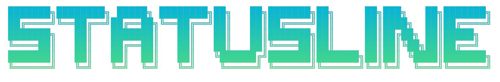
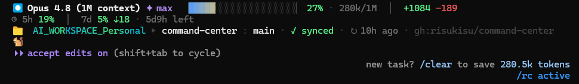

<div align="center">
  
  <p><sub>⏺ &nbsp;&nbsp; a 3-line micro-dashboard that lives in your Claude Code terminal &nbsp;&nbsp; 🐿️</sub></p>
</div>

<div align="center">

<a href="LICENSE"></a>


<sub>Windows Terminal · macOS · Linux · any truecolor terminal</sub>

</div>

---

A tiny, dependency-free status line for [Claude Code](https://docs.anthropic.com/en/docs/claude-code) that turns the empty bar at the bottom of your terminal into a glanceable dashboard: **which model + effort** you're on, **how much context** you've burned, **how close you are to your rate limits** (and whether you're burning them faster than the clock), and the **full git picture** of the repo you're in — branch, dirty files, ahead/behind, last sync, remote, and open PR.

It reads only the JSON Claude Code already pipes to a status-line command. **No API calls, no dependencies** — just `node` and a few fast `git` calls. (The optional [animal companion](#animal-companion-optional) is the one part that can do more — and only in its opt-in *react* mode.)

<p align="center">
  
</p>

> [!NOTE]
> The context bar is a live **blue → amber → red** fill and the launch-root name **shimmers** (an animated gradient) — a screenshot only catches one frame. Above is a real session in the personal workspace's cyan→mint.

---

## Contents

- [What it shows](#what-it-shows)
- [Install](#install)
- [Try it without Claude Code](#try-it-without-claude-code)
- [Customize — colour-code your workspaces](#customize--colour-code-your-workspaces)
- [Animal companion (optional)](#animal-companion-optional)
- [How it works](#how-it-works)
- [Project structure](#project-structure)
- [Troubleshooting](#troubleshooting)
- [License & credits](#license--credits)

---

## What it shows

Three lines, each with its own job.

### `Line 1` — session

```text
⏺  Claude Opus 4.8  ✦ high   ▕████████████░░░░░░░░▏ 61% · 610k/1M   │   +156 −23
```

| Segment | Meaning |
|---|---|
| `⏺ Claude Opus 4.8` | active model (`model.display_name`) |
| `✦ high` | reasoning effort / thinking level (`effort.level`) |
| `▕███░░▏ 61%` | context window used — gradient bar, **blue → amber → red** as it fills |
| `610k/1M` | tokens used / context window size (auto-scales to your window, incl. 1M) |
| `+156 −23` | lines added / removed this session (`cost`) |

### `Line 2` — limits

```text
◷ 5h 58% ⇡3 · 1h47m left   │   7d 81% · 2d3h left
```

| Segment | Meaning |
|---|---|
| `5h 58%` · `7d 81%` | % of the **5-hour** and **7-day** rate-limit windows used (green → amber → red) |
| `⇡3` / `⇣8` | **pace vs. the clock** — `⇡` = burning faster than time elapsed, `⇣` = under pace |
| `1h47m left` | time until that window resets |

### `Line 3` — git

```text
📁 my-workspace ▸ my-project : main · ✚3 · ⇡2 · ↻3h ago · gh:me/my-project · PR #12 pending
```

| Segment | Meaning |
|---|---|
| `📁 my-workspace` | **launch root** — the folder you started Claude in; *shimmers in your workspace colour* |
| `▸ my-project` | the repo you've `cd`'d into — shown **only** when it differs from the launch root |
| `: main` | current branch (white on `main`/`master`, amber otherwise) |
| `✚3` | uncommitted changes |
| `⇡2 ⇣1` | commits ahead / behind upstream — or `✓ synced` when clean and even |
| `↻3h ago` | age of the upstream's last commit |
| `gh:me/my-project` | origin remote (`gh:` = github.com; other hosts show their domain) |
| `PR #12 pending` | open PR number + review state (`approved` · `pending` · `changes requested` · `draft`) |

> `Line 4` is your optional **animal companion** — off by default (just a 🐿️), or a squirrel/fox/turtle that reacts to your work. See [Animal companion](#animal-companion-optional).

---

## Install

**Prerequisite:** [Node.js](https://nodejs.org) on your `PATH` (any recent version) and a truecolor terminal.

**1. Drop `statusline.js` into your Claude config folder.**

<details open>
<summary><b>macOS / Linux</b></summary>

```bash
curl -fsSL https://raw.githubusercontent.com/risukisu/claude-code-statusline/main/statusline.js \
  -o ~/.claude/statusline.js
```
</details>

<details>
<summary><b>Windows (PowerShell)</b></summary>

```powershell
irm https://raw.githubusercontent.com/risukisu/claude-code-statusline/main/statusline.js `
  -OutFile $HOME\.claude\statusline.js
```
</details>

**2. Register it** in `~/.claude/settings.json` (merge the block from [`settings.snippet.json`](settings.snippet.json)):

```json
{
  "statusLine": {
    "type": "command",
    "command": "node ~/.claude/statusline.js",
    "refreshInterval": 1
  }
}
```

> On **Windows**, use the full path (forward slashes are fine):
> `"command": "node C:/Users/YOUR_USERNAME/.claude/statusline.js"`
>
> `refreshInterval: 1` redraws once a second, which animates the workspace shimmer. Drop it if you'd rather not repaint every second.

**3. Restart Claude Code.** The dashboard appears at the bottom of the terminal.

---

## Try it without Claude Code

Pipe the bundled sample payload straight into the script to see the session + limits lines render:

```bash
# bash
cat examples/sample-input.json | node statusline.js
```
```powershell
# PowerShell
Get-Content examples/sample-input.json | node statusline.js
```

---

## Customize — colour-code your workspaces

The signature trick: **each launch root gets its own colour**, so a glance at line 3 tells you *which world you're in*.

I run two workspaces and keep them strictly separate — a **personal** one and one for my day job at **Appsilon**. Two PowerShell launchers start Claude in each (see [`examples/profile.ps1`](examples/profile.ps1)):

```powershell
function ccp { Set-Location 'D:\AI_WORKSPACE_Personal'; claude @args }   # personal
function cca { Set-Location 'D:\AI_WORKSPACE_Appsilon'; claude @args }   # work
```

…and `statusline.js` paints each root from `ROOT_PALETTES` — the personal root shimmers **cyan → mint**, the work root **amber → gold**:

```js
const ROOT_PALETTES = [
  { match: /^[a-z]:[\\/]+ai_workspace_personal/i, c1: [6, 182, 212],  c2: [74, 222, 128] }, // cyan → mint
  { match: /^[a-z]:[\\/]+ai_workspace_appsilon/i, c1: [245, 158, 11], c2: [253, 230, 138] }, // amber → gold
];
```

Make it yours: edit the `match` regexes to your own root paths and pick any two RGB endpoints. Add as many workspaces as you like — anything unmatched falls back to a calm static blue. (Everything else is tweakable too: bar width, palette constants, and the per-segment colours all live at the top of the file.)

---

## Animal companion (optional)

Line 4 can host a small **animal companion** that comments on your work. It's **off by default** — out of the box line 4 is just a quiet `🐿️`. Opt in and pick a character with `/animal`:

| mode | line 4 | cost |
|---|---|---|
| **off** (default) | just the emoji | none |
| **canned** | `🦊 ~ 14 files dirty and no commit. bold.` | none — rotates hand-written lines, keyed to your git/context state |
| **react** | `🦊 ~ refactoring auth? try not to lock yourself out` | one quick Haiku call per prompt |

Three souls ship in [`souls/`](souls/) — each a plain-markdown file with `work`, `ambient` (in-character musings shown when you're idle), and `react` sections you can **edit freely**:

- 🐿️ **squirrel** — manic, enthusiastic hoarder; scattered, cheerful energy
- 🦊 **fox** — clever and sly, with a little sass; efficiency-minded
- 🐢 **turtle** — slow, patient, wise; gently talks you out of rushing

**Set it up:**
1. Copy `souls/` to `~/.claude/souls/` and `commands/animal.md` to `~/.claude/commands/`.
2. In Claude Code, just run **`/animal`** — an interactive picker pops up to choose your companion and sentience level. (You can also pass them directly: `/animal fox react`, or `/animal off` to quiet it back to the emoji.)

> **React mode & your limits:** react mode runs `claude -p --safe-mode --model haiku` (~3s) on each prompt you submit — using your existing Claude Code login (no API key needed), but **counting toward your rate limits**, and sending your latest prompt to Haiku. It never blocks the status line: the call runs in a detached background process and line 4 shows the last result. `off` and `canned` make no model calls and read no transcript.

---

## How it works

Claude Code hands a status-line command a JSON blob on `stdin` describing the current session ([docs](https://docs.anthropic.com/en/docs/claude-code/statusline)). This script reads it and prints up to four lines. The fields it uses:

| Field | Drives |
|---|---|
| `model.display_name`, `effort.level` | line 1 model + effort |
| `context_window` | the gradient context bar |
| `cost.total_lines_added/removed` | the `+/−` diff counter |
| `rate_limits.five_hour` / `seven_day` | line 2 usage, pace arrows, reset countdowns |
| `workspace.project_dir` / `current_dir` | launch root (shimmer) vs. the repo you're in |
| `pr` | the PR badge |

Everything git-related comes from a couple of `git --no-optional-locks` calls in the current directory (capped, never throws). By default — **no network, no API keys, no transcript reads** — it stays well under ~100 ms. The optional animal companion's *react* mode is the sole exception: it reads your latest prompt from the transcript and fires a background Haiku call, never on the render path (see [Animal companion](#animal-companion-optional)).

The context bar's gradient is ported from [`getagentseal/codeburn`](https://github.com/getagentseal/codeburn). The launch-root shimmer is the same gradient technique you can watch standalone in [`extras/shimmer.ps1`](extras/shimmer.ps1).

---

## Project structure

```text
claude-code-statusline/
├── statusline.js            # the dashboard — drop in ~/.claude/
├── settings.snippet.json    # the statusLine block to merge into settings.json
├── examples/
│   ├── sample-input.json    # pipe this in to preview without Claude Code
│   └── profile.ps1          # ccp / cca dual-workspace launchers
├── extras/
│   └── shimmer.ps1          # standalone PowerShell gradient-shimmer demo
├── souls/                   # the three animal companions — edit freely
│   ├── squirrel.md
│   ├── fox.md
│   └── turtle.md
├── commands/
│   └── animal.md            # the /animal slash command
├── test/                    # node:test suite (zero deps)
├── LICENSE                  # MIT
└── README.md
```

---

## Troubleshooting

<details>
<summary>The bar / colours show up as plain text or escape codes</summary>

You need a **truecolor (24-bit) terminal** — Windows Terminal, iTerm2, or VS Code's terminal all work. The classic `cmd.exe` console does not.
</details>

<details>
<summary>The workspace name doesn't shimmer / animate</summary>

Add `"refreshInterval": 1` to the `statusLine` block — the shimmer advances with each redraw, so without periodic refresh it sits on one frame.
</details>

<details>
<summary>Line 3 says "no repo" or is missing</summary>

You're not inside a git repository, or `git` isn't on your `PATH`. The status line degrades gracefully — it just shows the launch folder and a 🐿️.
</details>

<details>
<summary>Nothing appears after editing settings.json</summary>

Restart Claude Code, and double-check the `command` path is correct (on Windows, the full `C:/Users/.../.claude/statusline.js` path with forward slashes).
</details>

---

## License & credits

**[MIT](LICENSE)** — use it, fork it, bend it to your setup. PRs welcome.

- Context-bar gradient ported from [getagentseal/codeburn](https://github.com/getagentseal/codeburn).
- Built for [Claude Code](https://docs.anthropic.com/en/docs/claude-code) and the JSON it pipes to status-line commands.
- Record your own demo GIF with [VHS](https://github.com/charmbracelet/vhs) by Charm.

<div align="center">
<sub>Made by <a href="https://github.com/risukisu">risu</a> · 🐿️</sub>
</div>
