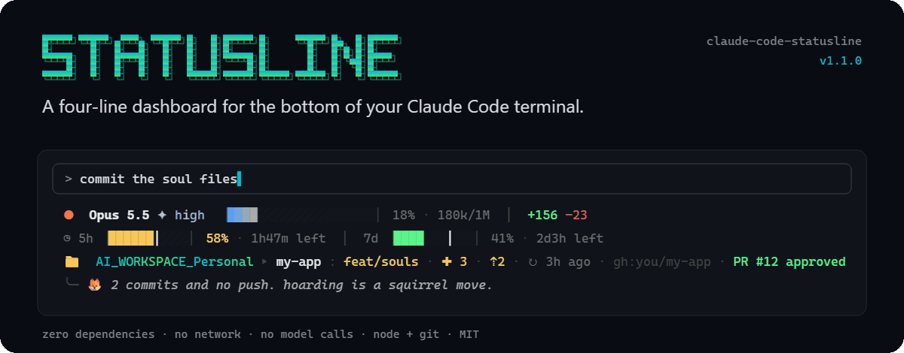
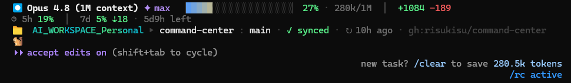
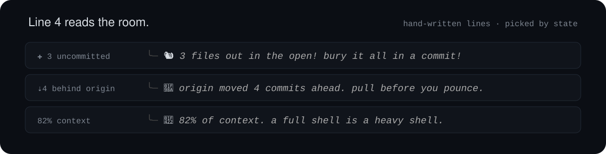

<p align="center">
  <picture>
    <source media="(prefers-reduced-motion: reduce)" srcset="assets/readme/hero.svg">
    
  </picture>
</p>

<p align="center">
  <a href="https://github.com/risukisu/claude-code-statusline/releases"></a>
  <a href="LICENSE"></a>
  
  
</p>

A status line for [Claude Code](https://docs.anthropic.com/en/docs/claude-code) that answers the questions you keep asking mid-session. Which model and effort am I on? How much context is left? Am I burning my rate limits faster than the clock? What state is this repo in? A small animal companion comments on all of it, if you want one.

It reads the JSON Claude Code already pipes to a status-line command, plus a few local `git` calls. **No network, no API keys, no model calls, no dependencies.** One Node file you drop into `~/.claude/`.

<p align="center">
  
</p>
<p align="center"><sub>A real session. The context bar and the workspace shimmer move; a screenshot catches one frame.</sub></p>

## Contents

- [What Each Line Shows](#what-each-line-shows)
- [Install](#install)
- [The Animal Companion](#the-animal-companion)
- [Settings](#settings)
- [How It Works](#how-it-works)
- [Troubleshooting](#troubleshooting)
- [Versions](#versions)

## What Each Line Shows

### Line 1: Session

```text
⏺  Opus 5.5 ✦ high  ▕████████████░░░░░░░░▏ 61% · 610k/1M · ⚠ /compact  │  +156 −23
```

| Segment | Meaning |
|---|---|
| `Opus 5.5` `✦ high` | active model and reasoning effort |
| `▕████░░▏ 61%` | context used. The heat is front-loaded: amber from 30%, orange at 40%, red from 50% |
| `⚠ /compact` | appears at 50%, where answers start to suffer; compact or start a fresh session |
| `610k/1M` | tokens used of the context window (scales to your window, 1M included) |
| `+156 −23` | lines added and removed this session |

### Line 2: Limits

```text
◷ 5h ▕█████│███░░▏ 80% · 2h30m left  │  7d ▕████░░│░░░░▏ 41% · 3d0h left
```

| Segment | Meaning |
|---|---|
| `▕█████` | how much of the 5-hour or 7-day window you've used |
| `│` | how much of the window's time has passed. Fill that stops before the notch means you're within pace |
| `███` past the notch | red: you're spending faster than the clock, and will run out before the reset |
| `80%` · `2h30m left` | usage in numbers, and time until the window resets |

### Line 3: Git

```text
📁  AI_WORKSPACE_Personal ▸ my-app : feat/souls · ✚ 3 · ⇡2 · ↻ 3h ago · gh:you/my-app · PR #12 approved
```

| Segment | Meaning |
|---|---|
| `📁 AI_WORKSPACE_Personal` | the launch folder, shimmering in its own [workspace colour](#colour-code-your-workspaces) |
| `▸ my-app` | the repo you're in, shown only when it differs from the launch folder |
| `feat/souls` | branch: white on `main`/`master`, amber elsewhere |
| `✚ 3` | uncommitted files |
| `⇡2` `⇣1` | commits ahead of and behind upstream, or `✓ synced` when clean and even |
| `↻ 3h ago` | age of the upstream's last commit |
| `gh:you/my-app` | the `origin` remote; click it to open the repo (`gh:` is github.com; other hosts show their domain) |
| `PR #12 approved` | the open PR and its review state: `approved`, `pending`, `changes requested`, or `draft`; click it to open the PR. GitLab merge requests read `MR !12` |

### Line 4: Companion

```text
╰─ 🦊 3 files dirty and no commit. living dangerously.
```

Off by default. The animal speaks in italics under line 3. See [The Animal Companion](#the-animal-companion).

## Install

You need [Node.js](https://nodejs.org) 18 or newer and a truecolor terminal: Windows Terminal, iTerm2, WezTerm, Kitty, or the VS Code terminal. macOS Terminal.app and the classic Windows console aren't truecolor and garble the colours.

### Let Claude Install It

Point Claude Code at this repo and say:

> install this status line on my machine

Claude follows [`AGENTS.md`](AGENTS.md): it copies the script, the souls, and the `/animal` command into `~/.claude/`, merges the settings block, checks the result, and tells you to restart.

### Install by Hand

<details open>
<summary><b>macOS / Linux</b></summary>

```bash
git clone https://github.com/risukisu/claude-code-statusline.git
cd claude-code-statusline
mkdir -p ~/.claude/souls ~/.claude/commands
cp statusline.js      ~/.claude/statusline.js
cp souls/*.md         ~/.claude/souls/
cp commands/animal.md ~/.claude/commands/
```
</details>

<details>
<summary><b>Windows (PowerShell)</b></summary>

```powershell
git clone https://github.com/risukisu/claude-code-statusline.git
Set-Location claude-code-statusline
New-Item -ItemType Directory -Force "$HOME\.claude\souls","$HOME\.claude\commands" | Out-Null
Copy-Item statusline.js      "$HOME\.claude\statusline.js"
Copy-Item souls\*.md         "$HOME\.claude\souls\"
Copy-Item commands\animal.md "$HOME\.claude\commands\"
```
</details>

Then merge this block into `~/.claude/settings.json`, keeping every key already there:

```json
{
  "statusLine": {
    "type": "command",
    "command": "node ~/.claude/statusline.js",
    "refreshInterval": 10
  }
}
```

On Windows, use the full path with forward slashes: `node C:/Users/YOUR_USERNAME/.claude/statusline.js`.

Restart Claude Code. The dashboard appears under the prompt, and line 4 invites you to run `/animal`. To check which version you have, run `node ~/.claude/statusline.js --version`.

### Preview Without Claude Code

Pipe in the sample payload:

```bash
cat examples/sample-input.json | node statusline.js            # bash
Get-Content examples/sample-input.json | node statusline.js    # PowerShell
```

## The Animal Companion

<p align="center">
  
</p>

Run `/animal` to pick a companion, or name one directly: `/animal fox`, `/animal off`. Every line it says is hand-written in a plain markdown soul file. It never calls a model.

- 🐿️ squirrel: manic, cheerful, forgets where the nuts are
- 🦊 fox: clever, sly, efficiency-minded, a little sassy
- 🐢 turtle: slow, patient, talks you out of rushing

The companion picks a new line every 30 seconds, based on what's going on. When something needs attention, two lines in three speak to it. The third is idle chatter, so the character still comes through.

| Section | When it speaks | Placeholder |
|---|---|---|
| `dirty` | you have uncommitted changes | `{dirty}` |
| `ahead` | you have commits you haven't pushed | `{ahead}` |
| `behind` | upstream has commits you don't | `{behind}` |
| `context` | the context window has reached the danger line (50% by default) | `{ctx}` |
| `limits` | the 5-hour window is at 80%, or you're 15+ points ahead of the clock | `{limit}` |
| `work` | any of the five above; also covers a soul that lacks one of them | |
| `synced` | clean and even with upstream | |
| `branch` | you're on a branch other than `main` or `master` | `{branch}` |
| `norepo` | you're outside a git repo | |
| `night` | midnight to 5 a.m., local time | |
| `ambient` | idle chatter | |

### Write Your Own Lines

Each soul in [`souls/`](souls/) is a markdown file with one bullet list per section. Edit `~/.claude/souls/<animal>.md` and the next redraw picks it up. Add `:noun` to a count to get a plural: `{dirty:file}` becomes "1 file" or "3 files". A line whose placeholder has no value right now is skipped, so a half-filled line never reaches the screen.

```markdown
## behind
- origin moved {behind:commit} ahead. pull before you pounce.
```

## Settings

Everything works without a settings file. To change the defaults, create `~/.claude/statusline.json` with only the keys you want; [`examples/statusline.json`](examples/statusline.json) has them all. Upgrades never touch this file, so edit it instead of `statusline.js`.

```json
{
  "theme": "default",
  "quiet": true,
  "links": true,
  "context": { "warn": 40, "danger": 50 },
  "palettes": [
    { "match": "ai_workspace_personal", "from": "#06b6d4", "to": "#4ade80" }
  ],
  "hide": []
}
```

| Key | Default | What it does |
|---|---|---|
| `theme` | `"default"` | `"default"`, `"high-contrast"` (brighter greys and text), or `"colorblind"` (blue, yellow, and vermillion instead of green and red) |
| `quiet` | `true` | dims what's healthy, like `✓ synced` or low usage, so only what needs attention stands out |
| `links` | `true` | makes the remote and the PR clickable |
| `context` | `40` / `50` | where the context bar turns orange (`warn`) and red with the `/compact` hint (`danger`) |
| `palettes` | two built-in | workspace shimmer colours; see below |
| `hide` | `[]` | segments to leave out: `effort`, `tokens`, `diff`, `limits`, `sync`, `remote`, `pr`, `companion` |
| `barWidth` | `20` (`12` in narrow terminals) | context bar width, 4 to 40 cells |

A bad value falls back to its default, so a typo never breaks the status line. Set the standard `NO_COLOR` environment variable to print plain text with no colour codes at all.

### Colour-Code Your Workspaces

Each launch folder can shimmer in its own colours, so line 3 tells you at a glance which workspace you're in. I keep a personal workspace and a work one strictly apart, and a PowerShell launcher starts Claude in each ([`examples/profile.ps1`](examples/profile.ps1)).

Each palette entry has a `match`, which is any part of the launch folder's path (case and slash direction don't matter), and two hex colours, `from` and `to`. The first entry that matches wins; unmatched folders show in plain blue. Without a `palettes` key, two built-in entries colour `ai_workspace_personal` cyan → mint and `ai_workspace_appsilon` amber → gold. An empty list turns the shimmer off.

## How It Works

Claude Code runs a status-line command after each message and every `refreshInterval` seconds, and hands it a JSON description of the session on stdin ([docs](https://docs.anthropic.com/en/docs/claude-code/statusline)). This script prints four lines from it:

| Input | Drives |
|---|---|
| `model.display_name`, `effort.level` | model and effort |
| `context_window` | the context bar and token count |
| `cost.total_lines_added` / `_removed` | the `+/−` counter |
| `rate_limits.five_hour` / `.seven_day` | usage, pace, and reset countdowns |
| `workspace.project_dir` / `.current_dir` | launch folder versus the repo you're in |
| `pr.number`, `pr.url`, `pr.review_state`, `pr.kind` | the PR badge and its link |
| `git status`, `rev-parse`, `config`, `log` | branch, changes, ahead/behind, remote |

Links use the OSC 8 escape code that Claude Code passes through to the terminal. The git reads use `--no-optional-locks` and short timeouts, and each session caches them for three seconds, so a burst of redraws runs git once. A render that Claude Code cancels exits on its own. Cache files live in `~/.claude/statusline-git.*`, and a new session clears the ones idle for a day.

## Troubleshooting

<details>
<summary>The colours show up as escape codes</summary>

Your terminal isn't truecolor. Use Windows Terminal, iTerm2, WezTerm, Kitty, or the VS Code terminal.
</details>

<details>
<summary>The repo and PR aren't clickable</summary>

Your terminal needs OSC 8 hyperlink support: Windows Terminal, iTerm2, WezTerm, Kitty, and the VS Code terminal have it. Ctrl+click (Cmd+click on macOS) opens the link. If the text shows but won't click, Claude Code may not have detected hyperlink support; set `FORCE_HYPERLINK=1` before launching Claude Code. Over SSH or inside tmux, the escape codes can get stripped.
</details>

<details>
<summary>The workspace name barely shimmers</summary>

The shimmer moves one step per redraw. With `refreshInterval: 10` that's once every ten seconds plus after each message. Lower values animate more, but every redraw starts a new process in every open session, so stay at 5 or above.
</details>

<details>
<summary><code>/animal</code> doesn't exist</summary>

Slash commands load at session start. Restart Claude Code, and check that `~/.claude/commands/animal.md` is there.
</details>

<details>
<summary>Line 3 says "no repo"</summary>

You're outside a git repository, or `git` isn't on your `PATH`. The line still shows the launch folder.
</details>

<details>
<summary>Nothing appears after editing settings.json</summary>

Restart Claude Code, and check the `command` path. On Windows it needs the full `C:/Users/.../.claude/statusline.js` path with forward slashes.
</details>

## Versions

Releases follow [semantic versioning](https://semver.org) and are listed on the [releases page](https://github.com/risukisu/claude-code-statusline/releases). [`CHANGELOG.md`](CHANGELOG.md) has the details, including upgrade notes for pre-1.0 installs. Working on the code? Start with [`CONTRIBUTING.md`](CONTRIBUTING.md).

## License and Credits

[MIT](LICENSE). Use it, fork it, bend it to your setup. PRs welcome.

- The context-bar gradient started as a port of [getagentseal/codeburn](https://github.com/getagentseal/codeburn).
- The README visuals are drawn from the script's own output by [`assets/readme/source/`](assets/readme/source/).

<p align="center"><sub>Made by <a href="https://github.com/risukisu">risu</a> · 🐿️</sub></p>
